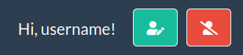

# User Manual

## Home
The **VariantAlert** landing page shows a short description 
of the tool and a minimized menu bar, 
with options only for unregistered users.

To access the full functionality of VariantAlert, 
users must sign up and then log in

## SignUp

By clicking on the SignUp button, it will be shown SignUp form

## Login

By clicking on the Login button, it will be shown Login form

## After Login
After login successfully, user is redirect on query form page.

Please note the changes in menu bar:
- An User menu to edit profile (green button) and to log out (red button) 

-  A new dropdown item in menu bar: **Variants**

## Add New
This is the page where users are automatically redirected after login.
Variant Alert offers users two ways to submit their variants to keep under control:
- **Single** mode, by filling out the form one variant at a time
- **Multiple** mode, by uploading a csv file containing all the variants

In any case, 
for each query the user must enter the following mandatory fields, 
to identify the variant according the HGVS name based variant id
- **Label**
- **Chromosome**
- **Genomic Position**
- **Assembly**
- **Reference Variant**
- **Alternative Variant**
- **Sources**

### Single Mode

After successfully submitting, user will be redirect in a **Details** page, 
where is showed result of query.
### Multiple Mode

In this case, the label will be the same for all variants.
An example csv file is available in the `files` folder
After successfully submitting, user will be redirect in a **History** page,
where is showed list of variants query.

### Sources

## Show all
The page (shows a table listing all the variants submitted by the user.

For each variant the query parameters, 
the creation date and the date of the last change are shown. 
In case there has been a change since the last login, 
the variant is marked with an alert tick. In addition, 
each variant features 3 action buttons.

- Green icon to show query results (**Detail** page)
- Red icon to delete the variant
- Blue icon to download query result as Excel file (`*.xlsx`)

Last but not least, 
a form located below the table allows you to filter 
and sort the list.

## Alerts
In particular, users can choose to view only 
variants that have had a change since the last login.

## Details
This page shows variant details and result query

## Download
as mentioned above, users can download query results as `*.xlsx` file 

